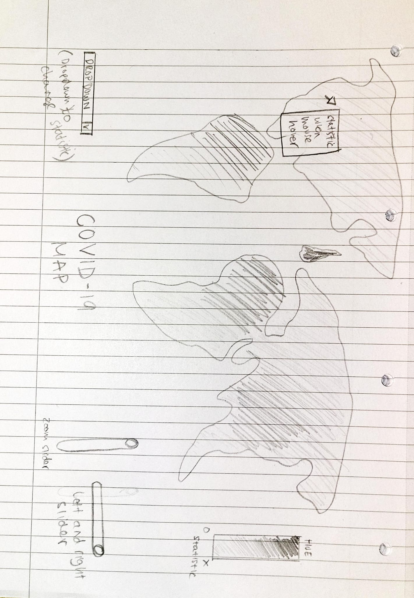

@import "../../lectures/css/datavis.less"

```elm {l=hidden}
import Tidy exposing (..)
import VegaLite exposing (..)
```

# Data Visualization Project Summary

{(whoami|} {|whoami)}

{(task|}

You should complete this datavis project summary document and submit it, along with any necessary supplementary files to **Moodle** by **Sunday 18th December, 5pm UK time**. Submissions will be awarded up to **80 marks** towards your coursework assessment total.

You are also encouraged to regularly commit and push changes to your datavis project throughout the term as you develop your project.

{|task)}

{(questions|}

- Which countries have been most affected by COVID-19, and how do these impacts compare to other countries? 
- Is economic inequality a contributing factor to the number of deaths caused by COVID-19? 
- What other factors may have a greater impact? Is this the same for total deaths? 

{|questions)}

{(visualization|}

## Visualization 1 - Global Covid-19 Statistics

```elm {v interactive}
covidMap : Spec
covidMap =
    let
        geoData =
            dataFromUrl "https://gicentre.github.io/data/geoTutorials/world-110m.json"
                [ topojsonFeature "countries1" ]


        data =
            dataFromUrl "https://TimurMahmud.github.io/data/covidsum.json" []

       
        trans =
            transform
                << lookup "properties.name" (data) "country" (luFields ["total_confirmed","total_deaths","total_recovered","active_cases","serious_or_critical","total_cases_per_1m_population","total_deaths_per_1m_population","total_tests","total_tests_per_1m_population","population"])  
                << calculateAs "datum[selection]" "color"

        ps =
            params
                << param "selection"
                    [ paValue (str "total_deaths")
                    , paBind
                        (ipSelect
                            [ inName "Data: "
                            , inOptions [ "total_confirmed",
                                "total_deaths",
                                "total_recovered",
                                "active_cases",
                                "serious_or_critical",
                                "total_cases_per_1m_population","total_deaths_per_1m_population",
                                "total_tests",
                                "total_tests_per_1m_population",
                                "population" ]
                            ]
                        )
                    ]

        enc =
            encoding
                << color
                    [ mName "color"
                    , mQuant
                    ,mTitle "Total Deaths"
                    ]
                << tooltips [ [ tName "properties.name"], [ tName "total_deaths"] ,[tName "total_deaths_per_1m_population"] ]       

        proj =
            projection [ prType equirectangular, prRotate -156 0 0 ]

        cfg = 
            configure
                << configuration (coView [vicoStroke Nothing])
                << configuration (coLegend [lecoOrient loBottomRight, lecoOffset 0])    
    in
    toVegaLite
        [ width 800
        , height 450
        , geoData 
        , cfg []
        , trans []
        , enc []
        , proj 
        , geoshape [ maStroke "black" ]
        , ps[]
        ]
```

## Visualization 1 Concept



## Visualization 2 - Inequality vs Covid-19 Deaths

```elm {v interactive}
giniTable : Spec
giniTable =
    let
        data =
            dataFromUrl "https://TimurMahmud.github.io/data/whrjson.json" []

        trans =
            transform
                << window [ ( [ wiOp woRowNumber ], "rowNumber" ) ] []

        ps =
            params
                << param "brush" [ paSelect seInterval [] ]

        encPoint =
            encoding
                << position X [ pName "COVID-19 deaths per 100,000 population in 2020", pQuant, pScale [ scZero False ] ]
                << position Y [ pName "Gini coefficient of income", pQuant, pScale [ scZero False ] ]
                << color
                    [ mCondition (prParam "brush")
                        [ mName "country" ]
                        [ mStr "grey" ]
                    ]

        specPoint =
            asSpec [ ps [], encPoint [], point [] ]

        tableTrans =
            transform
                << filter (fiSelection "brush")
                << window [ ( [ wiOp woRank ], "rank" ) ] []
                << filter (fiLessThan "rank" (num 20))

        encGini =
            encoding
                << position Y [ pName "rowNumber", pAxis [] ]
                << text [ tName "Gini coefficient of income" ]

        specGini =
            asSpec [ title "Gini coefficient of income" [], tableTrans [], textMark [], encGini [] ]

        encCovid =
            encoding
                << position Y [ pName "rowNumber", pAxis [] ]
                << text [ tName "COVID-19 deaths per 100,000 population in 2020", tFormat ".1f" ]

        specCovid =
            asSpec [ title "COVID-19 deaths per 100,000 population in 2020" [], tableTrans [], encCovid [], textMark [] ]

        encCountry =
            encoding
                << position Y [ pName "rowNumber", pAxis [] ]
                << text [ tName "country" ]

        specCountry =
            asSpec [ title "country" [], tableTrans [], encCountry [], textMark [] ]

        res =
            resolve
                << resolution (reLegend [ ( chColor, reIndependent ) ])

        cfg =
            configure
                << configuration (coView [ vicoStroke Nothing ])
    in
    toVegaLite
        [ cfg []
        , data
        , trans []
        , res []
        , hConcat [ specPoint, specGini, specCovid, specCountry ]
        ]
```
## Visualization 3 - Scatter Plot Matrix and Factors of Covid-19 Deaths

```elm {v interactive}
covidSplom : Spec
covidSplom =
    let
        data =
            dataFromUrl "https://TimurMahmud.github.io/data/whrjson.json" []

        ps =
            params
                << param "myBrush"
                    [ paSelect
                        seInterval
                        [ seOn "[mousedown[event.shiftKey], window:mouseup] > window:mousemove!"
                        , seTranslate "[mousedown[event.shiftKey], window:mouseup] > window:mousemove!"
                        , seZoom "wheel![event.shiftKey]"
                        , seResolve seUnion
                        ]
                    ]
                << param "grid"
                    [ paSelect seInterval
                        [ seTranslate "[mousedown[!event.shiftKey], window:mouseup] > window:mousemove!"
                        , seZoom "wheel![event.shiftKey]"
                        , seResolve seGlobal
                        ]
                    , paBindScales
                    ]

        enc =
            encoding
                << position X [ pRepeat arColumn, pQuant ]
                << position Y [ pRepeat arRow, pQuant ]
                << color [ mCondition (prParam "myBrush") [ mName "country" ] [ mStr "grey" ] ]
    in
    toVegaLite
        [ repeat
            [ rowFields [ "Gini coefficient of income", "Index of exposure to COVID-19  infections in other countries as of March 31", "Log of average distance to SARS countries", "Index of institutional trust", "Median age" ]
            , columnFields [ "COVID-19 deaths per 100,000 population in 2020","Excess deaths in 2020 per 100,000 population, relative to 2017-2019 average"]
            ]
        , specification (asSpec [ data, ps [], enc [], point [], width 400
        , height 400 ])
        ]
```


{|visualization)}

{(insights|}

##### Insight one

In this research, the aim was to understand the countries that have been most affected by COVID-19 and compare the impact to other countries. To do this, data was collected and visualized on a map, including various metrics such as total confirmed cases, total deaths, total recovered, active cases, serious or critical cases, total cases per 1 million population, total deaths per 1 million population, total tests, total tests per 1 million population and population of countries. The initial assumption was that countries with large populations, such as India and China, would be most affected by COVID-19 due to the virus's ability to spread easily in highly populated areas. This assumption held true for India, with countries like Brazil and the United States having higher death tolls. However, this was not the case for China, as the metrics represented in the visualization showed that China had lower numbers in these categories. When looking at the number of serious or critical cases, India and China were on the lower end of the spectrum, while Brazil was at the highest, followed by Mexico. Additionally, when considering the impact of COVID-19 in terms of population, both India and China had lower numbers on the hue spectrum, indicating a lower impact compared to other countries. This suggests that while it may be assumed that densely populated countries like India and China have been most affected by COVID-19, the data indicates that when considering the impact proportionately, these countries are not as heavily impacted as countries in South America or Europe.

##### Insight two

In recent times, the COVID-19 pandemic has impacted the lives of people all around the world. One question that has emerged is whether there is a correlation between the Gini coefficient, which is a measure of income inequality, and the number of COVID-19 deaths per 100,000 in a given population.
Initially, it may seem logical to assume that there would be some correlation between the two variables, as it is often assumed that lower income individuals may be more vulnerable to the disease due to a lack of access to healthcare and other resources. However, upon further analysis, it appears that this assumption may not hold true.
Through the use of visualizations, it has been determined that there is no correlation between the Gini coefficient and the number of COVID-19 deaths per 100,000 in 2020. This can be seen in the general structure of the graph, which does not display any clear relationship between the two variables. Additionally, when calculating the correlation specifically, it is found to be approximately 0.1, which is a very weak correlation.
Therefore, it can be concluded that my initial hypothesis was incorrect. It is not the case that the Gini coefficient is significantly correlated with the number of COVID-19 deaths per 100,000 in a population. While it is certainly possible that other factors, such as access to healthcare and the effectiveness of a country's response to the pandemic, may have played a role in the number of deaths, the Gini coefficient does not seem to be a significant predictor.
Overall, this insight highlights the importance of carefully analyzing data and not making assumptions based on preconceived notions. It also serves as a reminder that the relationship between variables is often complex and nuanced, and cannot be fully understood without thorough investigation.


##### Insight three

In an effort to understand what factors may have had the greatest impact on COVID-19 deaths per 100,000 population in 2020, I conducted a study using a scatter plot matrix to analyze the data. The variables included in the analysis were the COVID-19 deaths per 100,000 population in 2020, Excess deaths in 2020 per 100,000 population relative to the 2017-2019 average, the Gini coefficient of income, the Index of exposure to COVID-19 infections in other countries as of March 31, the log of the average distance to SARS countries, the Index of institutional trust, and the median age of the population.
Upon analyzing the data, it became clear that certain factors displayed a stronger correlation with COVID-19 deaths per 100,000 population than others. Specifically, the Index of exposure to COVID-19 infections in other countries as of March 31 and the log of the average distance to SARS countries showed a decent positive correlation, with a correlation coefficient of approximately 0.55. This suggests that these factors may have had a significant impact on the number of COVID-19 deaths in a given population.
On the other hand, the Index of institutional trust displayed a light negative correlation, with a coefficient of approximately -0.39. This suggests that higher levels of institutional trust may be associated with lower numbers of COVID-19 deaths.
However, it is important to note that the median age of the population and the Gini coefficient of income showed little correlation with COVID-19 deaths per 100,000 population. This suggests that these factors may not have had as significant of an impact as initially assumed.
Overall, the insight gained from this analysis is that certain factors, such as the Index of exposure to COVID-19 infections in other countries and the average distance to SARS countries, may have had a greater impact on COVID-19 deaths per 100,000 population in 2020. It is worth noting that the same may not necessarily hold true for total deaths, as other factors may have played a role in this metric.


{|insights)}

{(designJustification|}

##### Choropleth Maps

I have chosen to use choropleth maps to visualize COVID-19 data because they are particularly useful for visualizing data that varies across a region. These maps use colored shading or patterns to represent data values within geographic areas, which allows the viewer to easily see patterns and trends in the data over time or across different regions.
In the context of COVID-19 data, choropleth maps can be an effective way to show the spread and impact of the virus across different countries. For example, a choropleth map could be used to show the total number of confirmed cases or deaths in each country, allowing viewers to easily compare the severity of the outbreak in different areas. The map could also be used to show how the virus has spread over time, by using different colors to represent different time periods.
I have considered good practice when creating these maps, as they can be prone to distortion and can be misleading if not properly designed. According to Tufte (2001), one of the key principles of good data visualization is "high data-ink ratio," which means using the least amount of ink (in the case of a printed map) or pixels (in the case of a digital map) to convey the maximum amount of information. I have achieved this by using a clear and concise color scheme and avoiding unnecessary decorative elements or distractions.
I have found that using a choropleth map for this type of data visualization can be particularly effective because it allows the viewer to easily see patterns and trends in the data by geography. For example, the map can show areas with higher or lower levels of confirmed cases, deaths, or recovered individuals, and can highlight any clusters or hotspots that may exist. Additionally, the use of a choropleth map can help to put the data into context by showing how it relates to the geography and population of the different countries. This can be particularly useful for understanding the impact of the pandemic on a global scale.
According to Monmonier (1996), these maps are useful because they are easy for the viewer to understand and can highlight patterns and trends within the data. Tobler (1970) also notes that choropleth maps can be used to compare data for different regions and show the relationship between the data and the geography of the area being represented. In summary, choropleth maps are effective at communicating complex information because they use color to represent data values and can show patterns, trends, comparisons, and relationships between data and geography.
It is also important to consider the limitations of choropleth maps, as they can only show data at the aggregate level and do not provide information about individual data points. This can be a particular issue when visualizing data for small areas, as the data may be masked by the larger area surrounding it. In such cases, it may be more appropriate to use a different type of visualization, such as a dot density map or a cartogram.
Overall, I believe that choropleth maps can be a useful tool for visualizing COVID-19 data, but it is important to consider the limitations of this type of visualization in order to effectively communicate the data.


##### Juxtaposition

I chose to use juxtaposition in the data visualization for the choropleth map showing data on COVID-19 in order to allow the viewer to easily compare the different metrics being visualized, such as total confirmed cases, total deaths, and total recovered. This helps the viewer to understand the relationships between different variables and to see patterns or trends that may not be immediately apparent when looking at a single visualization.
In the case of the scatter plot matrix, I used juxtaposition to highlight the correlations or relationships between the various socio-economic and demographic factors and COVID-19 deaths and excess deaths. By placing the scatter plots side by side, the viewer can easily compare the trends and patterns between different variables, which can help to inform their understanding of the data.
According to literature on data visualization, juxtaposition is a common technique used to compare and contrast different aspects of data. By placing two or more visualizations side by side, the viewer can easily compare different variables or trends and look for relationships or patterns between them. This can help to facilitate the discovery of insights and to increase the viewer's understanding of the data.
For example, in a study by Chen and colleagues (2017), the authors found that juxtaposition was an effective way to visualize data, as it allowed the viewer to quickly compare different variables and see the relationships between them. Similarly, in a review by Correll (2014), the author notes that juxtaposition can be a useful technique for comparing different aspects of data, particularly when visualizing multiple variables or trends. By using juxtaposition, the viewer can easily compare different aspects of the data and see the relationships between them, which can help to increase their understanding and facilitate the discovery of insights.
Overall, the use of juxtaposition in data visualization can be an effective design choice, as it allows the viewer to easily compare and contrast different aspects of the data and see the relationships between them. This aligns with good data visualization practices, which emphasize the importance of using clear and effective visual encodings to communicate information effectively to the viewer.


##### Interactiveness

I included interactivity in the data visualization for the global COVID-19 choropleth map in order to allow the viewer to explore and understand the data in more depth. For example, the use of a drop-down menu to allow the viewer to select different fields, such as total confirmed cases, total deaths, and total recovered, can help the viewer to better understand the relationships between different variables and to see patterns or trends. Similarly, the interactivity when hovering over countries to show the data on COVID-19 can provide the viewer with more detailed information about specific countries and allow them to see the relationships between different variables.
In the scatter plot (visualization 2), I included interactivity, such as the zoom and brush tool, in order to allow the viewer to focus on specific points or areas of the plot and see the relevant data on those countries in a table. This can help the viewer to better understand the relationships between different variables and to identify patterns or trends.
In the scatter plot matrix comparing various socio-economic and demographic factors to COVID-19 deaths and excess deaths, I included interactivity in order to allow the viewer to move any of the scatter plots in the matrix and see how the other plots respond. This can help the viewer to understand the relationships between different variables and to see how changes in one variable can affect the other variables.
Overall, the use of interactivity in data visualization can be an effective design choice, as it allows the viewer to explore and understand the data in more depth and facilitate the discovery of insights. This aligns with good data visualization practices, which emphasize the importance of using interactive elements to engage the viewer and enhance their understanding of the data. For example, a study by Jankun-Kelly and colleagues (2003) found that interactive elements can be an effective way to enhance the viewer's understanding of complex data sets, while a review by Shneiderman (1996) notes that interactivity can be particularly useful when visualizing large or complex data sets.


{|designJustification)}

{(references|}

References:
•	Tufte, E. R. (2001). The visual display of quantitative information (2nd ed.). Cheshire, CT: Graphics Press.
•	Monmonier, M. (1996). How to lie with maps (2nd ed.). Chicago, IL: University of Chicago Press.
•	Tobler, W. R. (1970). A computer movie simulating urban growth in the Detroit region. Economic Geography, 46(2), 234-240.
•	Chen, H., Heer, J., & Bostock, M. (2017). Data-Driven Techniques for Effective Visualization. ACM Transactions on Computer-Human Interaction (TOCHI), 24(6), 1-34.
•	Correll, M. (2014). A review of design principles for data visualization. In Eurographics conference on visualization (pp. 1-22). Eurographics Association.
•	Jankun-Kelly, T. J., Robertson, G. G., & Chen, C. (2003). The effectiveness of interactive visualization in understanding large data sets. In Visualization, 2003. VIS 2003. IEEE (pp. 9-16). IEEE.
•	Shneiderman, B. (1996). The eyes have it: A task by data type taxonomy for information visualizations. In Visual languages (pp. 336-343). IEEE Computer Society Press.


{|references)}
